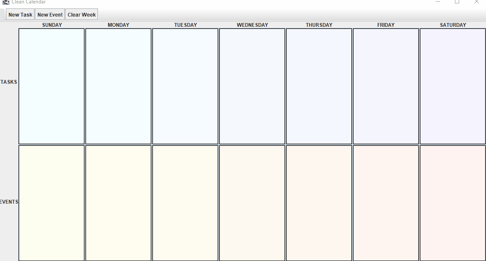
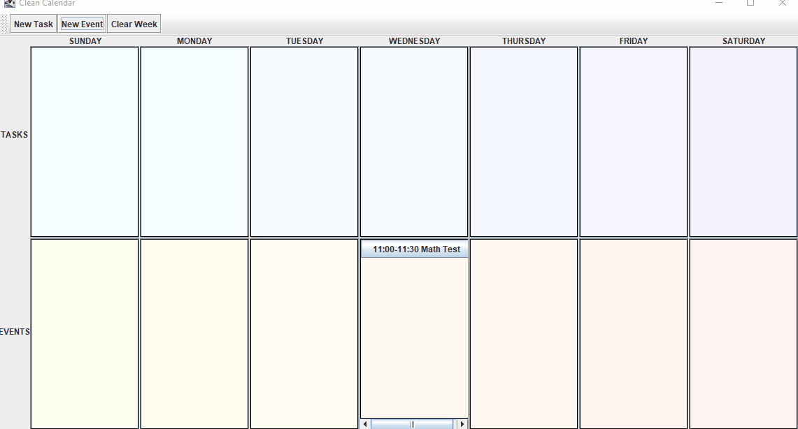
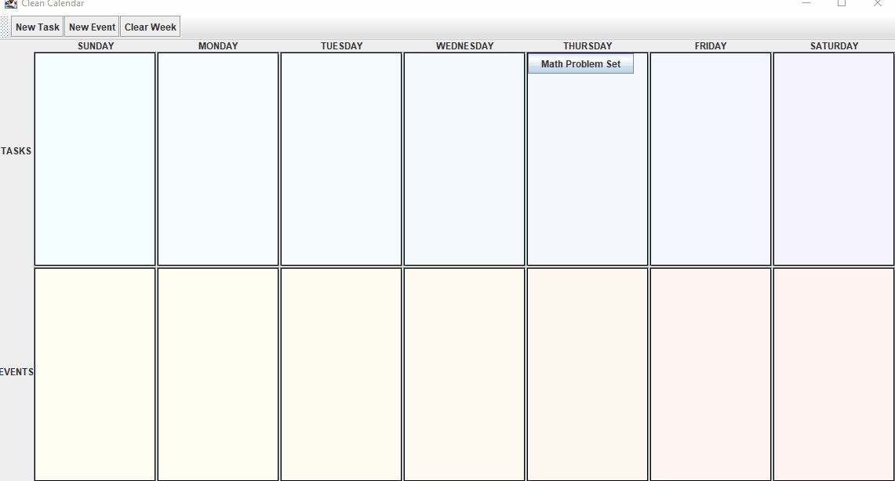
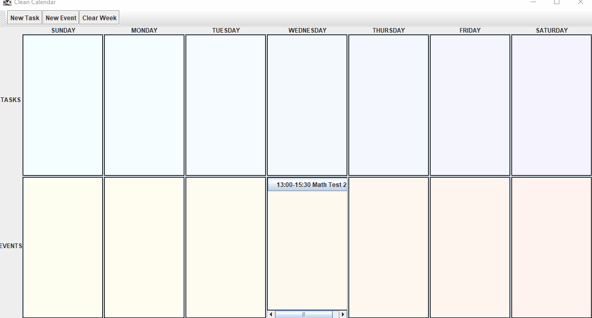
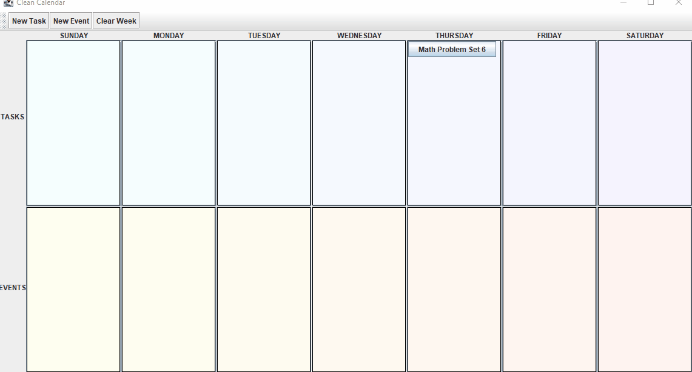
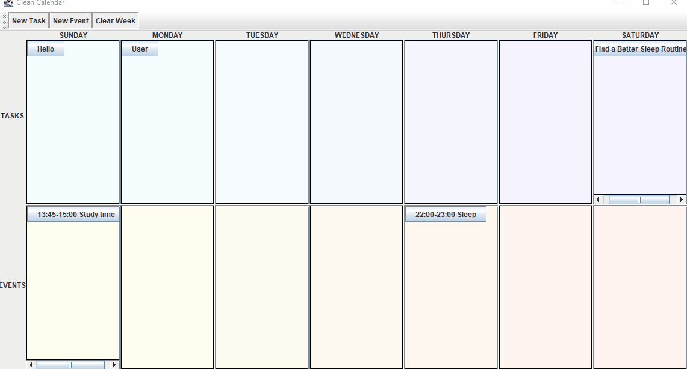

# Clean Calendar

This repository contains code for our groups CSC207 project, a Task and Event Management application. Through our program, a user can
manage their weekly
1. __Tasks__ which can be thought of as "to-do"s that don't have any timeframe attached to them. For example, 'Bake Cookies' is a task.
2. __Events__ which have a specified start and end time, unlike tasks. For example, 'CSC207 Lecture from 1 to 2 PM' is an event.

Our program allows the user to Create Tasks and Events, Modify Tasks and Events, Mark Tasks as completed or uncompleted, Delete Tasks and Events and clear their weekly schedule in case the user wants to start from scratch.

# Instructions

Clone the ```main``` branch of the code base. Invoke ```Main.java``` in the ```src/main/java``` directory. We have provided the following GIFs, which demonstrate each use case, for the user's convenience.

### Create Event



### Create Task


### Modify Event



### Modify Task



### Delete Event



### Delete Task



### Complete Task


### Clear All


